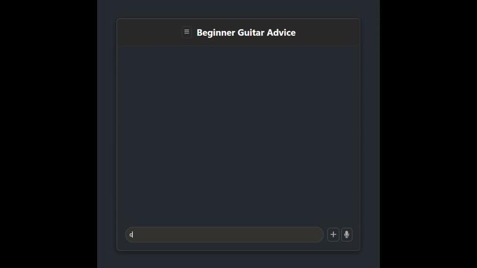

# Guitar Advice For Beginners

This AI Chatbox provides advice for guitar players just starting out



---

## Table of Contents
* [Installation](#installation)
* [Deployment](#deployment)
    * [Local Deployment](#local-deployment)
    * [Frontend Deployment (Github Pages)](#frontend-deployment-github-pages)
    * [Backend Deployment (Render)](#backend-deployment-render)
* [Usage](#usage)

---

## Installation
1.  **Clone the repository:**
    ```bash
    git clone https://github.com/seanavers/beginner-guitarist-chatbox.git
    ```
2.  **Navigate to the project directory:**
    ```bash
    cd beginner-guitarist-chatbox
    ```
3.  **Install dependencies:**
    ```bash
    cd frontend
    npm install
    ```
    ```bash
    cd ../backend
    npm install
    ```
4.  **Create your `.env` file in the backend of your project:**

    ```
    GOOGLE_API_KEY=your_google_api_key_here
    ```
---

## Deployment
This setup uses `gh-pages` for the frontend and Render for the backend

### Local Deployment
Navigate to `guitar-store-locator` directory in your terminal

1.  **Frontend:**
    ```bash
    cd frontend
    npm start
    ```
    (This usually opens the app at `http://localhost:3000`)
2.  **Backend:** (in a separate terminal)
    ```bash
    cd backend
    node server.mjs
    ```
    Backend will run at `http://localhost:3001`.

### Frontend Deployment (Github Pages)
-   **Configure** `package.json`: Add a `homepage` property to `package.json` that points to your GitHub Pages URL  (e.g., `https://your-github-username.github.io/your-repo-name`).

-   **Install** `gh-pages` if you haven't already:
    ```bash
    npm install --save-dev gh-pages
    ```
-   **Add Deploy Script:** located in `scripts` section of `package.json`
    ```bash
    "scripts": {
        "predeploy": "npm run build",
        "deploy": "gh-pages -d build",
        "start": "react-scripts start",
        "build": "react-scripts build",
        ...
    }
    ```
* **Run Deployment:** From your project root:
    ```bash
    npm run deploy
    ```
    This builds the React App and pushes it to the `gh-pages` branch

### Backend Deployment (Render)
-   **Create a New Web Service On Render:**
    -   Go to your [Render Dashboard](https://dashboard.render.com/).
    -   Click "New" -> "Web Service".
    -   Connect your GitHub repository containing the backend code.
-   **Configure Build and Start Commands:**
    -   "Build Command" should be `npm install` or empty and "Start Command" should be `node server.mjs`
-   **Set Environment Variables:**
    -   In the Dashboard add `GOOGLE_API_KEY`
-   **CORS Configuration:**
    -   Modify `server.mjs` to allow requests from your Github Pages frontend
  ```bash 
  import cors from "cors";
  app.use(cors({
    origin: "https://your-github-username.github.io"
}));
  ```
-   **Deploy:**
    -   Render automatically deploys backend
    -   Note the public URL provided  (`e.g., https://your-backend-name.onrender.com`).

---

## Usage
1.  **Open the app with your Github Pages URL or local frontend**
2.  **Type or Speak a question:**
    -   You can type in the chatbox or click the microphone icon to activate voice input 
3.  **The AI will construct a response (using RAG):**
4. **The current chat gets saved to the sidebar (accessed by clicking the hamburger menu)**
    -   Press outside the sidebar to close it
5. **Continue to type in your current chat or press the + button to start a new chat**
    - Or close the app entirely, it's up to you dude 