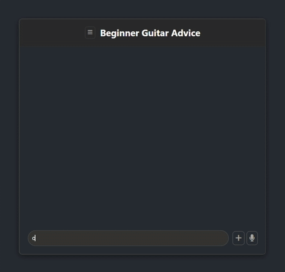

# Guitar Advice For Beginners

This AI Chatbox provides advice for guitar players just starting out

Built using React, Node.js, and the Gemini Flash Lite API.

---

# Future Feature: RAG Implementation
While the application is fully functional, the next phase involves implementing Retrieval-Augmented Generation (RAG) using Python. This allows the chatbot to reference a custom knowledge base that provides answers based on my own playing experience. 

